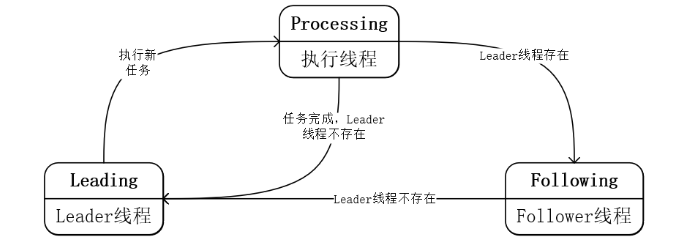

# BlockingQueue 
阻塞队列，可以用于生产者消费者模型

## 继承关系
### Collection
Collection是抽象的集合概念，有几类功能：
1. 集合可以添加、删除元素
2. 可以获取集合的大小，判断是否为空
3. 可以判断是否包含元素
4. 可以遍历整个集合
5. 转化为其他的类型，如stream和array

### Queue
Queue集成了Collection。除了具备集合的特点之外，还有自身的特点。一般来说Queue是一个有序的队列。
* FIFO：先进先出
* Priority Queue：优先级队列
* LIFO：后进先出

Queue按照对元素操作种类来分，有三种：
1. 加入 insertion
2. 抽取 extraction
3. 探查 inspection

按照返回类型来分，有两种：
1. 失败返回异常
2. 失败返回特定值

| Actions    | Throws exception | Returns special value        |
|------------|------------------|------------------------------|
| Insert     | add(e)           | offer(e)                     |
| Remove     | remove(e)        | poll(e)                      |
| Examine    | element(e)       | peak(e)                      |


### BlockingQueue
BlockingQueue在Queue的基础上增加了阻塞式操作队列的操作。
* 当队列为空时，取出元素的操作会被阻塞
* 当队列为满时，增加元素的操作会被阻塞

BlockingQueue的主要操作如下：

| Actions    | Throws exception | Returns special value        | Blocks  | Times out            |
|------------|------------------|------------------------------|---------|----------------------|
| Insert     | add(e)           | offer(e)                     | put(e)  | offer(e, time, unit) |
| Remove     | remove(e)        | poll(e)                      | take(e) | poll(time, unit)     |
| Examine    | element(e)       | peak(e)                      | -       | -                    |


对于BlockingQueue来说，不能插入null；而Queue只是一般来说不建议插入null。
并且对于BlockingQueue来说，虽然继承了Queue接口和Collection接口，但一般不建议使用阻塞接口以外的接口。
BlockingQueue还提供了查询剩余可以插入的元素的数量，即剩余容量的查询接口。如果为无限容量，name就返回Integer.MAX_VALUE

### TransferQueue
TransferQueue是BlockingQueue的子接口，主要是为了确保发送的信息能被消费者消费到而增加来一些接口
> A BlockingQueue in which producers may wait for consumers to receive elements. A TransferQueue may be useful for example in message passing applications in which producers sometimes (using method transfer) await receipt of elements by consumers invoking take or poll, while at other times enqueue elements (via method put) without waiting for receipt.

```java
public interface TransferQueue<E> extends BlockingQueue<E> {
    boolean tryTransfer(E e);
    void transfer(E e) throws InterruptedException;
    boolean tryTransfer(E e, long timeout, TimeUnit unit) throws InterruptedException;
    boolean hasWaitingConsumer();
    int getWaitingConsumerCount();
}
```

## 实现类
### LinkedBlockingQueue
LinkedBlockingQueue是BlockingQueue的一个FIFO实现类。
* FIFO
* 如果没有制定长度，那么最大长度是Integer.MAX_VALUE；制定后为指定值
* 吞吐量比较大，但在大多数的并发场景下，性能可预测性比较差

对于LinkedBlockingQueue来说，它通过分别的读写锁来实现。而元素的数量则使用一个AtomicInteger来表示，从而避免对数值变化是，同时获取两把锁。
这样可以保证多个并发读操作或者多个并发写操作当原子性。
那么读写之间的原子行如何保证呢：
1. 首先我们看LinkedBlockingQueue内部数据结构的时间。其内部所有的元素都在一个链表上。头节点为element为null的节点。当链表没有任何元素时，头节点的element为null，其next也为null。
2. 如果count为0时，对LinkedBlockingQueue进行读写操作，所有的take操作都会被阻塞，而put操作不会被阻塞。也就是说所有对空的头节点的读操作都会被阻塞，不能执行，对头节点只能进行写操作。很显然，这时候读写操作不会同时操作。
3. 当执行写操作时，首先将要写入的node加入到链表上，然后再改变count的值。由于读操作阻塞条件时监控count的值，即使有一个瞬间，新的node被加入到链表上，而数量还没有变，读操作也感知不到。
4. 通过对count的监控，这样就保证了读写操作不会同时操作头节点的next指针。
5. 当count不为0，且小于最大容量时，这时读写操作都可以进行。由于有读操作操作的时头指针，而写操作则操作的时尾指针，读写操作分别操作链表的不同node，所以读写操作不会产生冲突
6. 当count达到了最大容量时，这时只能进行读操作。所以也不会读写冲突。
7. 当对LinkedBlockingQueue遍历时，所有读写锁同时都会锁住。

具体的读写操作时，链表的变化可以参考[LinkedBlockingQueue.drawio](LinkedBlockingQueue.drawio)

### ArrayBlockingQueue
ArrayBlockingQueue也是一个BlockingQueue的FIFO实现类。与LinkedBlockingQueue的区别在于，它的底层存储结构使用的是数组而非链表。
并且，ArrayBlockingQueue还支持一种公平的FIFO模式。这种公平的FIFO模式会降低变化避免某些线程长时间得不到响应，但是也会降低队列总的性能。

首先分析ArrayBlockingQueue的内部数据结构。

ArrayBlockingQueue内部有
1. 一个数组用来存放数据； 
2. 一个putIndex和一个takeIndex分别用来表示当前put和take的位置，初始化为0；
3. count表示当前元素的数量，初始化为0
4. lock为全局读写锁
5. notEmpty和notFull都是从lock中生成的Condition变量


通过分析源码可以知道
1. ArrayBlockingQueue初始化时，会根据输入的capacity大小建立一个数组
2. 读写操作时，首先要加全局锁
3. put直接将要写入的数据写入到putIndex指向的位置，然后putIndex自增1，一旦回绕，则从数组头0开始
4. take直接读取takeIndex指向位置的数据，然后putIndex也自增1，一旦回绕，则从数组头0开始
5. 保证线程按照请求顺序访问，主要是靠将lock初始化为一个公平锁。公平锁每次尝试获取lock之前，都会查看是否有其他线程在等待，而非公平锁不会，如果能马上得到锁，则会立即执行。

### PriorityBlockingQueue
PriorityBlockingQueue底层使用一个基于数组的二叉堆来实现的。二叉堆满足二个特性：
1．父结点的键值总是大于或等于（小于或等于）任何一个子节点的键值。
2．每个结点的左子树和右子树都是一个二叉堆（都是最大堆或最小堆）。

二叉堆上，queue[n]的子节点为queue[2*n+1]和queue[2(n+1)]。
PriorityBlockingQueue使用的堆是一个最小堆。

数组实现的最小二叉堆上，插入一个新堆元素的操作如下：
1. 检查是否需要扩容，并在需要扩容时完成扩容
2. 尝试将新元素加入队列中，首先放到队列末端（array中实际数据存放的末端）
3. 调整二叉堆，以满足二叉堆的条件
   * 父结点的键值总是小于或等于任何一个子节点的键值
   * 每个结点的左子树和右子树都是一个最小堆
4. 如果要满足二叉堆的条件，首先要看加入的新的元素，有可能会破坏哪些条件的
   1. 新元素小于其父节点
   2. 新元素所在的子树不是一个最小堆
5. 调整的原则为，找到当前新插入的元素的父节点，然后比较大小，如果父节点比新的节点小，则进行交换，直到完成堆顶元素的替换
6. 这样调整后，将原有比新节点大的父节点和当前节点调换位置后，原父节点的父节点本来有的两个节点，其中一个未变，肯定是小于该节点的。新换过的节点比原来的更小，肯定也是小于该节点的。换过后的子树由于每次替换都保证整个子树为一个最小树，所以肯定也是最小树。
7. 时间复杂度为1->logN

移除堆顶元素的操作如下：
1. 说明移除原理之前，首先再次看一下二叉堆要满足的条件：
   1. 父结点的键值总是小于或等于任何一个子节点的键值
   2. 每个结点的左子树和右子树都是一个最小堆
2. 那么说明移除以后，仍然要满足这两个条件。
3. 分析移除了头节点后的二叉堆，其最小值可能在哪里？
   1. array[1] 左子树
   2. array[2] 右子树
4. 那么究竟在左子树还是右子树上呢？可以将最后一个元素取出，放入到头节点的位置上，然后分别和左右子树比较，看那个小就和哪个交换，直到交换到最尾端。
5. 时间复杂度为logN


对这个堆所有的操作都由一个全局锁来保护。
然而，当调整堆大小的时候，会使用一个简单的自选锁来允许并发的读操作。

PriorityBlockingQueue的内部数据结构：
* queue：用于存放平衡二叉树的队列。。
* lock：全局锁
* comparator：比较器，用来比较元素的大小
* notEmpty：condition，当为空时，会进行阻塞

### DelayQueue
只有delay时间到了的元素才能被取出来。DelayQueue采用了Leader-Follower设计模式
> An unbounded blocking queue of Delayed elements, in which an element can only be taken when its delay has expired. 
> 

#### Leader-Follower设计模式
Leader-Follower线程模型有三个重要的线程：Leader线程、Processor线程以及Follower线程
- Leader线程：始终监控任务队列，执行新任务并唤醒Follower线程争夺Leader线程的位置
- Processor线程：任务执行线程，总是是由Leader线程转换而来，任务执行完成后可能成为Leader线程，也可能阻塞成为Follower线程。
- Follower线程：阻塞的任务线程，可能由Processor线程转换而来，也可能是新提交的线程任务被阻塞成为Processor线程。


在Leader-Follower线程模型永远只有一个Leader线程，同时有多个Processor线程以及若干个Follower线程。我们假设线程池中有N个线程，Processor线程有X个，Leader线程始终只有一个，那么Following线程的数量为：N - X - 1。

Leader线程会实时监控任务列表，如果有新的任务到达，Leader线程会转换成Processor线程并处理对应的任务，同时还会唤醒阻塞的Follower线程，这时候Follower线程便会抢占资源成为Leader线程（永远只会有一个Leader线程）。

在Processor线程处理完成后，可以再次竞争资源成为Leader线程，也可能因为Leader线程存在而阻塞成为Follower线程，而Follower线程的目标始终只有一个那便抢占资源成为Leader线程。

以上便是Leader-Follower线程模型的执行模式，线程始终在Leader、Processor以及Follower角色中转换，同时线程状态始终在Leading、Processing以及Following之间转换，周而复始，直到线程池终止为止。



#### DelayQueue中的Leader-Follower设计模式
DelayQueue使用了一种Leader-Follower设计模式的变种，从而最小化非必要的等待时间。
1. DelayQueue的头是过期最长的一个元素，如果没有延时到期的元素，则poll时会返回null
2. 对于未过期的元素，不能删除或取出。但统计大小时会一起统计
3. 允许取出新加入的等待时间较短的元素


DelayQueue每次加入一个新元素时，都会将其加入到优先级队列中。
优先级队列是按照剩余等待时间排序的最小堆。
如果新加入的元素等待时间最短，且当前有等待取出的leader线程，则终止原有的等待的leader，重新发起一次take
如果take时，等待时间最少的元素的等待时间为0或者负数，则直接取出返回。
如果take时，等待时间最少的元素的等待时间为正数，且leader为空，则将leader线程设置为本线程，然后开始等待，并设置超时时间为当前头节点的剩余等待时间。
如果take时，等待时间最少的元素的等待时间为正数，且leader不为空，则直接开始等待。
如果take过程中，没有新加入的元素，或者新加入元素的等待时间不为最小值，则leader线程继续运行并返回头节点，然后通知其他等待的线程。
其他的等待线程开始抢锁，然后抢到的继续之前的take过程。

从上面的分析可以得出，leader线程用来等待超时时间结束，一旦结束之后，就会唤醒剩余的等待线程。
剩余等待线程在锁竞争之后，会产生一个新的leader线程，然后继续之前的过程。

也就是说，DelayQueue中的Leader-Follower设计模式的角色如下：
Leader线程：用来等待超时结束的阻塞的take的线程
Follower线程：leader之外的阻塞的take的线程
Processor线程：take返回后的线程，自动转化为leader线程。（可能成为过leader线程，也可以没有）

### SynchronousQueue
SynchronousQueue有两种模式，一种是公平模式，一种是非公平模式。
公平模式下，使用的是双端队列，而非公平模式下使用的是栈模式。

对于SynchronousQueue来说，节点分为两种：
- 请求节点
- 数据节点

如果队列中只有请求节点，没有数据节点，那么请求节点所代表的线程将会被阻塞
反之亦然。

另外，SynchronousQueue内部没有存储空间，这样就造成了读取和写入的阻塞
- 写入数据时，如果这时没有等待读取的线程，则会阻塞
- 读出数据时，如果这时没有等待写入的线程，则会阻塞
- 无法遍历

无论是队列还是栈，都继承了抽象类Transferer。这个抽象类定义了一个方法transfer，
用来实现put或者take的操作。transfer这一个方法就可以统一代表两个操作，是因为
双数据结构下，put和take操作是对称的，所以几乎大部分的代码都能合并处理。
这就导致transfer函数比较长，但还是比拆成几乎重复但两部分更好遵循。

队列和栈的数据结构除了一点细节之外，大部分都概念相似。为了简单起见，还是将他们
分开，这样以后更好分开演进。

SynchronousQueue实现了一种名为"Nonblocking Concurrent Objects with
Condition Synchronization"的[算法](http://www.cs.rochester.edu/u/scott/synchronization/pseudocode/duals.html)，
但为了更好的在同步队列中使用，并且能够处理中断，SynchronousQueue进行了一些
修改：
1. 原始算法使用位标记指针，但此处的算法在节点中使用模式位，从而导致许多进一步的调整。
2. SynchronousQueues一定会阻塞线程，直到条件满足为止
3. 支持通过超时和中断方式取消put或者take

SynchronousQueue使用LockSupport的park和unpark对线程进行阻塞。但如果
能够在自旋一下后，节点可以满足条件，那对应的线程就不会阻塞。当竞争很多时，
自旋可以极大的提高吞吐量。如果竞争不多时，少量的自旋基本上时察觉不到的。

队列和栈有不同的清理的方式。
* 对队列来说，如果节点被取消了，那么就可以直接删除
* 对栈来说，我们还需要再遍历一下才能确定是否可以删除。

下面为stack实现的transfer方法的原理
```java
/*
 * Basic algorithm is to loop trying one of three actions:
 *
 * 1. If apparently empty or already containing nodes of same
 *    mode, try to push node on stack and wait for a match,
 *    returning it, or null if cancelled.
 *    如果stack为空，或者已经有相同模式的节点，那么就尝试将新的节点
 *    也加入到栈中等待match后返回。如果cancel时还没有match，那么就
 *    返回null
 *
 * 2. If apparently containing node of complementary mode,
 *    try to push a fulfilling node on to stack, match
 *    with corresponding waiting node, pop both from
 *    stack, and return matched item. The matching or
 *    unlinking might not actually be necessary because of
 *    other threads performing action 3:
 *    如果栈中包含了一个互不模式的节点，那么就尝试将一个fulfilling模式
 *    的节点推入栈中，匹配对应的等待的节点后，从stack中弹出，然后将匹配
 *    的数据返回。
 *    但因为操作3但存在，很有可能需要进行匹配和断开链接。
 *
 * 3. If top of stack already holds another fulfilling node,
 *    help it out by doing its match and/or pop
 *    operations, and then continue. The code for helping
 *    is essentially the same as for fulfilling, except
 *    that it doesn't return the item.
 *    如果stack中已经包含了另外的一个fulfilling模式的节点，通过匹配或者弹出操作帮助它出栈
 *    然后再重复之前的操作。这部分代码除了不返回值以外，和操作2几乎相同。
 */
```

### LinkedTransferQueue


