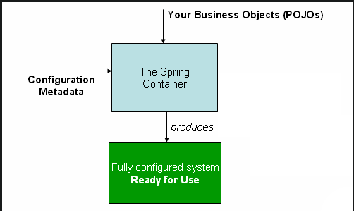
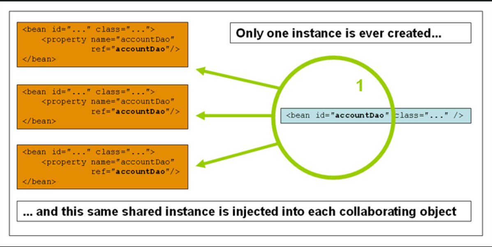
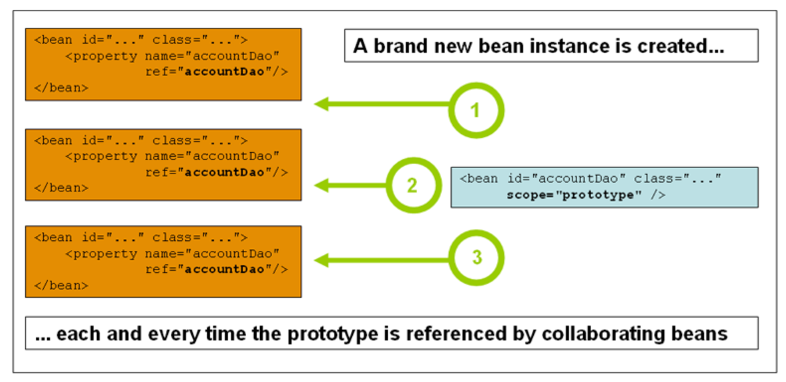

# IOC in Spring
Spring的IOC全称是`Inversion of Control`，也可以称作控制翻转。
主要作用是，将实例的创建，销毁等管理从程序员自己在程序中维护，转移到容器中维护。
程序员只需要使用这些创建好的实例。

## 概念
IOC也称为`Dependency Injection`，也就是依赖注入。Spring中的依赖注入的工作流程如下：
1. 对象需要首先定义它的依赖
   - 通过构造函数的参数定义依赖
   - 通过工厂方法定义依赖
   - 通过set方法定义依赖
2. 容器在创建这个对象的时候，会将这些依赖注入进来。

`IOC`的源码主要在`org.springframework.beans`和`org.springframework.context`这两个包中。
这里面有两个很重要的接口，`BeanFactory`接口提供了一套高级配置机制，用来管理任何类型的对象。
`ApplicationContext`是`BeanFactory`的子接口，与BeanFactory相比，增加了:
- 对Spring AOP的一种简单集成
- 国际化（Message Resource管理）
- Event发布机制
- 应用层的上下文，如`WebApplicationContext`

Spring称这些被Spring管理的你的应用程序中的对象为beans

## 容器概览
Spring中的`org.springframework.context.ApplicationContext`接口，代表了Spring容器，主要用来实例化，配置和集成beans。
容器根据配置元数据，来做这些实例化，配置和集成beans的工作。Spring中的配置元数据类型主要有：
- xml配置文件
  - ClassPathXmlApplicationContext
  - FileSystemXmlApplicationContext
- java注解
- java代码

下图为Spring容器的示意图。如这个示意图所示，根据你写的代码和对应的配置文件初始化启动后的Spring容器会负责把所有的应用程序配置好，并使这个程序为可用的状态。


### 配置元数据
配置元数据用来指导开发人员如何告诉Spring容器创建，配置和集成应用程序中的对象。
- xml格式
  - beans
  - bean
- java注解
- java代码
  - Configuration
  - Bean
  - Import
  - DependsOn

Spring配置元数据要求至少要有一个bean，但一般来说都会有多个bean。
- xml使用`beans`作为最顶层的元素，每一个bean都使用`bean`作为其标签
- java代码使用`@Bean`注解表示每一个bean，而这个注解所在的类要使用`@Configuration`注解。

### 容器的创建
`ApplicationContext`构造函数需要的path和paths，就是提供给容器的配置元数据的地址。一般来说就在当前的目录，或者`CLASSPATH`里面。
```java
ApplicationContext context = new ClassPathXmlApplicationContext("services.xml", "daos.xml");
```

### 容器的使用
`ApplicationContext`是一个高级的工厂，能够记录一组不同的beans和它们相关的依赖。这样，可以通过调用`ApplicationContext`的`T getBean(String name, Class<T> requiredType)`
方法，得到所需的bean。

```java
// create and configure beans
ApplicationContext context = new ClassPathXmlApplicationContext("services.xml", "daos.xml");

// retrieve configured instance
PetStoreService service = context.getBean("petStore", PetStoreService.class);

// use configured instance
List<String> userList = service.getUsernameList();
```

虽然`ApplicationContext`提供了获得bean的接口，但在理想情况下，应用代码不会使用这些方法。这样应用程序就不会依赖Spring程序。

## Bean Overview
`Spring IoC`容器管理多个bean。这些bean都是根据你给容器的配置元数据来创建的。

在`Spring`内部，这些bean的配置信息都是保存在一个一个的`BeanDefinition`类里面的。`BeanDefinition`里面包含了以下的信息：
- class的全限定名: 带包名的class名称，一般来说是被定义的bean的实际实现类。
- bean行为配置元素: 在制定状态下bean对应的在容器里的行为，如scope，lifecycle callbacks等。
- bean所需的依赖。一般是依赖的其他的bean。
- 创建这个bean所需的其他参数。比如创建数据库时所需的数据库默认大小等。

这个元信息会被转化为组成每一个bean的定义的属性。如下表所示：

| Property                 | Explained in…            |
|--------------------------|--------------------------|
| Class                    | Instantiating Beans      |
| Name                     | Naming Beans             |
| Scope                    | Bean Scopes              |
| Constructor arguments    | Dependency Injection     |
| Properties               | Dependency Injection     |
| Autowiring mode          | Autowiring Collaborators |
| Lazy initialization mode | Lazy-initialized Beans   |
| Initialization method    | Initialization Callbacks |
| Destruction method       | Destruction Callbacks    |

另外，`Spring`也支持用户将已经存在的objects直接加入到容器中来。可以通过调用容器的 `getBeanFactory()`方法，得到ApplicationContext的BeanFactory。
默认的`BeanFactory`是`DefaultListableBeanFactory`。`DefaultListableBeanFactory`支持使用`registerSingleton(..)`和`registerBeanDefinition(..)`
将已有的object注册到容器中。但是，一般来说，不建议这么做。

### 给Bean命名
每一个`bean`都应该有一个或者多个唯一的标识符，这些标识符在`bean`所在的容器中应该是唯一的。一个`bean`通常只有唯一的一个标识符。然而，如果需要多个标识符，
那么超出的这些标识符会被当做`别名`来处理。

在xml的配置文件中，可以使用`id`或者`name`，或者两者结合在一起来指定bean的标识符。`id`只让你指定一个标识符。习惯上，这些标识符都是字符型的，但也支持特殊字符。
如果你想指定其他的标识符，可以使用`name`。标识符之间使用空格，`,`或者`;`来隔开。

对于`Spring`容器里定义的`bean`来说，`id`或者`name`都不是必须的。如果这两个属性一个都没有的话，那么容器会自动为它分配一个。但如果想引用这个bean的话，那一定要指定一个。
一般来说，只有内部bean或者自动织入（autowiring collaborators）的时候，才使用没有名字的bean。

### 实例化beans
bean的定义是容器创建对象的关键。当容器要创建一个类的时候，就会首先去查找bean的定义，然后根据这个定义创建出实际的对象。

一般来说，bean的定义中都会有这个bean的类型（class）。当然也有例外，如通过bean定义的继承，或者通过实例工厂方法创建。
你可以通过以下两种方式来使用这个class类型
- 容器一般会向程序一样，使用class的构造方法创建对象。
- 容器使用指定的静态工厂方法创建对象。

#### 使用构造方法创建
使用构造方法创建bean是比较通用的做法，但根据使用的容器的不同，你可能需要在class中有一个默认的无参构造函数。

事实上，Spring容器可以管理你想让它管理的任何class，

#### 使用静态工厂方法创建
使用静态构造方法也可以创建bean。Spring容器会把这个bean当成是和使用构造方法创建的一样的bean来进行管理。
一般来说，这种方式都是用于在老代码的类中使用Spring容器。

```xml
<bean id="clientService"
    class="examples.ClientService"
    factory-method="createInstance"/>
```

这个类的代码如下
```java
public class ClientService {
    private static ClientService clientService = new ClientService();
    private ClientService() {}

    public static ClientService createInstance() {
        return clientService;
    }
}
```

#### 使用一个实例的工厂方法创建
和使用静态工厂方法类似
```xml
<!-- the factory bean, which contains a method called createInstance() -->
<bean id="serviceLocator" class="examples.DefaultServiceLocator">
    <!-- inject any dependencies required by this locator bean -->
</bean>

<!-- the bean to be created via the factory bean -->
<bean id="clientService"
    factory-bean="serviceLocator"
    factory-method="createClientServiceInstance"/>
```

对应的class的java代码如下
```java
public class DefaultServiceLocator {

    private static ClientService clientService = new ClientServiceImpl();

    public ClientService createClientServiceInstance() {
        return clientService;
    }
}
```

#### 确定一个bean的运行时类型（runtime type）
运行时的bean类型很难确认。bean定义中制定的class可能会应为生命的工厂方法改变，或者作为BeanFactory而成为不同的一个类型，或者通过instance级别的工厂方法创建。
初次以外，AOP也可能会改变bean的运行时类型。

如果需要准确的判断bean的运行时类型，那么你可以通过使用`BeanFactory.getType`方法，来得到实际的bean的运行时类型。

## 依赖
### 依赖注入（Dependency Injection）
对象可以通过构造方法里面的参数，或者工厂方法里面的参数，或者内部的属性来定义它工作时所需要的依赖。依赖注入就是在对象通过构造函数或者工厂方法实例化后，将所需的依赖注入到对象实例中的过程。

得益于DI和IoC，程序可以变得更加的整洁，也使得解耦变得更加容易。bean对象不需要自己去找它的依赖所在的位置或者依赖的具体类型。使得程序更加容易测试。

DI有两种主要的形式，构造器注入和Setter注入。
`ApplicationContext`对它所管理的bean支持构造器或者setter的依赖注入。同样也支持在同时使用这两种方式对同一个依赖进行注入。它会首先使用构造器注入，再使用setter注入对之前的注入实例进行覆盖。

那么，该如何选择何时使用构造器注入，何时选择setter注入呢？
一般来说，对于必须需要的依赖，那么建议使用构造器注入。对于可选择的注入，可以使用Setter注入。
虽然对于Setter来说，也可以使用`@Require`来表示该属性是必须的。
但构造器注入可以使用到程序的校验，所以建议使用这种形式

更进一步来说，使用构造器注入，可以使得刚刚构造出来的bean的必须的依赖都不为null。但如果构造器中的参数过多，很可能是因为这个类的职责太多导致的。
一般建议重构这个类将其内部的职责分开。

对于使用Setter注入的依赖来说，一般都会给一个默认值，以方式后续的访问中，出现`NullPointException`的风险。

#### 依赖解析的顺序
容器按照下面的顺序解析依赖
- `ApplicationContext`从配置文件中，或者java代码中，或者注解中，解析出所有的bean的定义。
- 对于每一个bean来说，容器会在创建它的时候，提供响应的所有依赖。
- 每个要被注入的属性都是实现定义好的值，或者其他的bean
- 容器可以将这些被注入的属性转成需要的类型

Spring会在容器创建的时候，检查所有bean的定义是否是有效的。但只会在真正需要bean的时候才会创建这个bean。
而何时创建bean则和这个bean定义的scope有关系。对于单例模式的bean来说，会在容器创建的时候进行创建。
而对于原型模式的bean来说，只会在需要的时候才进行创建。而依赖注入则需要先把bean实例化之后，然后才可以进行依赖的注入。
但正是这种注入的方式，使得每次注入的时候都会是很多相互关联的bean一同被创建出来。而如此多的相互依赖的bean同时创建，就有可能会导致问题。

例如，当一个A创建时需要B的bean，而B创建时需要A的bean进行注入，这样就形成了循环依赖。为了解决这种循环依赖，可以将构造器注入改为setter注入。
但某些时候，即使使用了Setter也不能解决循环依赖的问题。
例如，A创建时，需要执行一个自定义init函数，这个函数调用了A依赖B的实例的一个方法。而B创建时，也需要执行一个自定义的init的函数，这个函数又需要执行B依赖的A的实例的一个方法。
这种情况下，还是会有循环依赖的问题。

一般来说，Spring都会检查出这些异常，并将被依赖的一方，先进行初始化。

### 懒加载
一般来说，对于单例模式的bean来说，Spring容器都会在开始时就进行创建。这样可以发现问题，避免程序运行一段时间后才在延迟初始化的时候发现问题。
对于Spring来说，既可以对每一个bean控制加载的方式，也可以通过对整体进行控制。
```xml
<beans default-lazy-init="true">
    <bean id="lazy" class="com.something.ExpensiveToCreateBean" lazy-init="true"/>
    <bean name="not.lazy" class="com.something.AnotherBean"/>
</beans>
```

### AutoWiring 
Spring可以自动织入相互之间协作的bean，它可以自动通过分析`ApplicationContext`，织入bean所需要的协作者，自动织入有以下的优势:
- 自动织入可以有效的减少需要指定的属性和构造器参数
- 自动织入可以避免对配置文件的改动。

### 方法注入
Spring的容器如果要将不同生命周期的bean注入到一起时，会出现问题。例如单例的bean A，内部使用了一个原型模式的bean B。因为单例模式的bean只会在容器初始化的时候创建一次，
所以它内部的bean也只会在创建的时候织入。但B是一个原型模式，我们想要的是每次调用都使用一个新创建的bean。

通常，我们也可以通过打破spring设计原则的方式，通过直接调用spring容器的getBean方法，得到原型bean。但这种模式会使得业务代码和spring框架代码相互耦合。
所以，我们引入了通过方法注入的方式。

#### Lookup方法注入
`Lookup Method`方式注入其实就是通过覆写目标bean的方法来实现的。一般来说，注入的bean都是原型模式的。
Spring使用CGLIB库自动生成字节码形式的子类，覆写该方法来实现的。

需要注意的是：
- 这个类必须是可以被继承的，该方法也必须是可以覆写的。
- 如果是具体的方法（非抽象方法），也需要能够被扫描到
- 使用了Lookup注入，那么这个类就不能使用工厂方法的方式的方式声明为bean，比如使用`@Bean`，而只能使用`@Component`的方式声明。这是因为，这种情况下，容器并不负责生成这个bean，而是由工厂方法负责的。

`Lookup Method`的形式如下。
> <public|protected> [abstract] <return-type> theMethodName(no-arguments);

通过method的定义可以看出
- 方法只能是public或者protected类型的
- 可以是abstract的，也可以是concrete的
- 一定要声明它的retern type，这个就是注入的内容
- 函数没有参数
- 既可以通过bean名字来解析需要的bean，也可以通过类型来解析需要的bean
- 如果通过abstract方法注入，那么一定要以Concrete类的方式将其注入到Spring容器中。因为Spring容器在创建bean的时候，会自动忽略所有的abstract class。

> 也可以通过`ObjectFactory/ Provider`的方式实现这种不同生命周期的bean的注入。

## Bean Scope
当Spring创建的Bean定义，其实是可以通过这个Bean的定义创建多个这个类的实例。
Bean的Scope是和Bean的生命周期联系到一起的，指的是Bean在何时创建，何时销毁。Spring有以下几种Scope

| Scope       | Description                                                                                                                                                                                                                                                |
|-------------|------------------------------------------------------------------------------------------------------------------------------------------------------------------------------------------------------------------------------------------------------------|
| singleton   | (Default) Scopes a single bean definition to a single object instance for each Spring IoC container.                                                                                                                                                       |
| prototype   | Scopes a single bean definition to any number of object instances.                                                                                                                                                                                         |
| request     | Scopes a single bean definition to the lifecycle of a single HTTP request. That is, each HTTP request has its own instance of a bean created off the back of a single bean definition. Only valid in the context of a web-aware Spring ApplicationContext. |
| session     | Scopes a single bean definition to the lifecycle of an HTTP Session. Only valid in the context of a web-aware Spring ApplicationContext.                                                                                                                   |
| application | Scopes a single bean definition to the lifecycle of a ServletContext. Only valid in the context of a web-aware Spring ApplicationContext.                                                                                                                  |
| websocket   | Scopes a single bean definition to the lifecycle of a WebSocket. Only valid in the context of a web-aware Spring ApplicationContext.                                                                                                                       |


### 单例bean
对于Spring来说，只在容器创建的时候创建一次所有的单例bean。创建完成后，会将这些单例bean放到一个cache中。
后续所有获取单例bean的操作都是从这个cache中查找。如下图所示：


Spring的单例bean和GoF的单例设计模式是不一样的。GoF的单例模式，是在一个`Class Loader`中只会存在一个实例。
而Spring的单例bean则是每一个Spring容器和一个Bean的定义只会生成一次Bean。
也就是说，如果一个Class Loader中启动了多个Spring容器，那么单例bean也可以在同一个`Class Loader`中存在。
同时，如果一个Spring容器中定义了同一个类的多个bean，那么对于这个Class来说，其在同一个容器中也有多个实现。

### 原型bean 
每一次注入，或者每次调用getBean，都会生成一个新的bean。
按照规定来说，单例Scope用来存放无状态的bean，而原型Scope用来存放有状态的bean。


对于原型bean来说，spring容器不会管理它的全生命周期。容器会负责实例化，依赖注入以及初始化操作，并执行相应的初始化callback调用。
然后就将创建好的bean交给client，之后就由client来负责管理这个bean。如销毁这个bean并释放相关的资源。
也就是说，spring容器不会对原型模式的bean执行销毁回调方法。

### 单例bean中的原型bean依赖
由于生命周期不同，单例bean中的原型bean是在初始化的时候创建的，也就是说，一旦创建后，单例bean中的原型bean就不会改变了。
如果想在运行时创建原型bean，那么可以使用`method injection`的方式。

### Request, Session, Application, and WebSocket Scopes
这些scope只在网络相关的上下文中才有效，如`XmlWebApplicationContext`。如果在非网络相关上下文中使用，那么会抛出`IllegalStateException`异常，
表示这个Scope是未知的Scope。

要使用这些scope，需要对Spring做一些启动的配置。
但其背后的原理都是通过`DispatcherServlet, RequestContextListener 和 RequestContextFilter`将HTTP request和对应的响应这个请求的Thread绑定。
这样，在后续的调用链中，就可以使用对应scope的bean了。

#### Request Scope
分析下面的一个xml格式的bean定义

```xml
<bean id="loginAction" class="com.something.LoginAction" scope="request"/>
```

当每次处理一个新的Http请求的时候，Spring容器就会使用`loginAction`的BeanDefinition来创建一个新的bean。
也就是说，每隔http请求都有其自己的`loginAction`。在这个http请求中对这个`loginAction`修改时，不会影响到其他的http请求中的bean。
当http请求完成后，对应的bean也会忽略掉。

#### Session Scope
分析下面的xml格式的bean定义
```xml
<bean id="userPreferences" class="com.something.UserPreferences" scope="session"/>
```
针对每一个`Http Session`，容器都会创建一个新的`userPreferences`。


#### Application Scope
分析下面的xml格式的bean定义
```xml
<bean id="appPreferences" class="com.something.AppPreferences" scope="application"/>
```
针对每一个`ServletContext`，容器都会创建一个新的`appPreferences`。这个bean会作为ServletContext的一个属性。

#### 依赖中使用Scope beans
从上面的介绍可以看出来，对于不同Scope的bean来说，它们的生命周期有长有短。如果在长周期的bean中引用短周期的bean时，就有可能出现问题。
例如，在一个单例的bean中引用一个request scope的bean时，这个单例bean是在容器初始化的时候将相关的依赖注入进来的。
但这时，request还没有开始处理，也就是说需要的bean还没有创建。如果这个时候进行注入操作，那么得到的注入的bean并不是想要的。

对于这种情况，也可以使用代理的方式，先创建一个和接口相同的代理类，然后通过代理类，在使用时调用真正的类。

下面是一个xml配置的例子
```xml
<?xml version="1.0" encoding="UTF-8"?>
<beans xmlns="http://www.springframework.org/schema/beans"
    xmlns:xsi="http://www.w3.org/2001/XMLSchema-instance"
    xmlns:aop="http://www.springframework.org/schema/aop"
    xsi:schemaLocation="http://www.springframework.org/schema/beans
        https://www.springframework.org/schema/beans/spring-beans.xsd
        http://www.springframework.org/schema/aop
        https://www.springframework.org/schema/aop/spring-aop.xsd">

    <!-- an HTTP Session-scoped bean exposed as a proxy -->
    <bean id="userPreferences" class="com.something.UserPreferences" scope="session">
        <!-- instructs the container to proxy the surrounding bean -->
        <aop:scoped-proxy/> 
    </bean>

    <!-- a singleton-scoped bean injected with a proxy to the above bean -->
    <bean id="userService" class="com.something.SimpleUserService">
        <!-- a reference to the proxied userPreferences bean -->
        <property name="userPreferences" ref="userPreferences"/>
    </bean>
</beans>
```

#### 选择注入代理的类型
默认情况下，对于`<aop:scoped-proxy/>`来说，spring会使用CGLIB创建其代理类。

> 需要注意的是，CGLIB只代理public的接口，所以不要试图在它创建代理类中调用非public的接口。

当然，也可以使用jdk自带的的动态代理。但这样就要求被代理类至少继承一个接口，而且使用这个依赖的类调用的也是这个类继承的接口的方法。


### 自定义Scope
bean的scope机制是可以扩展的。你可以定义自己的scope，也可以覆写现有的scope。但覆写现有的scope是一种坏的实践方式。
但是，单例模式和原型模式是不能覆写的。

#### 创建一种新的scope
如果要新建一种新的scope，需要继承`org.springframework.beans.factory.config.Scope`接口，
Scope接口有4个方法，用来获取objects，从scope移除该对象，以及让它们被销毁。
```java

/**
 * Strategy interface used by a {@link ConfigurableBeanFactory},
 * representing a target scope to hold bean instances in.
 * This allows for extending the BeanFactory's standard scopes
 * {@link ConfigurableBeanFactory#SCOPE_SINGLETON "singleton"} and
 * {@link ConfigurableBeanFactory#SCOPE_PROTOTYPE "prototype"}
 * with custom further scopes, registered for a
 * {@link ConfigurableBeanFactory#registerScope(String, Scope) specific key}.
 *
 * <p>{@link org.springframework.context.ApplicationContext} implementations
 * such as a {@link org.springframework.web.context.WebApplicationContext}
 * may register additional standard scopes specific to their environment,
 * e.g. {@link org.springframework.web.context.WebApplicationContext#SCOPE_REQUEST "request"}
 * and {@link org.springframework.web.context.WebApplicationContext#SCOPE_SESSION "session"},
 * based on this Scope SPI.
 *
 * <p>Even if its primary use is for extended scopes in a web environment,
 * this SPI is completely generic: It provides the ability to get and put
 * objects from any underlying storage mechanism, such as an HTTP session
 * or a custom conversation mechanism. The name passed into this class's
 * {@code get} and {@code remove} methods will identify the
 * target object in the current scope.
 *
 * <p>{@code Scope} implementations are expected to be thread-safe.
 * One {@code Scope} instance can be used with multiple bean factories
 * at the same time, if desired (unless it explicitly wants to be aware of
 * the containing BeanFactory), with any number of threads accessing
 * the {@code Scope} concurrently from any number of factories.
 *
 * @author Juergen Hoeller
 * @author Rob Harrop
 * @since 2.0
 * @see ConfigurableBeanFactory#registerScope
 * @see CustomScopeConfigurer
 * @see org.springframework.aop.scope.ScopedProxyFactoryBean
 * @see org.springframework.web.context.request.RequestScope
 * @see org.springframework.web.context.request.SessionScope
 */
public interface Scope {

	/**
	 * Return the object with the given name from the underlying scope,
	 * {@link org.springframework.beans.factory.ObjectFactory#getObject() creating it}
	 * if not found in the underlying storage mechanism.
	 * <p>This is the central operation of a Scope, and the only operation
	 * that is absolutely required.
	 * @param name the name of the object to retrieve
	 * @param objectFactory the {@link ObjectFactory} to use to create the scoped
	 * object if it is not present in the underlying storage mechanism
	 * @return the desired object (never {@code null})
	 * @throws IllegalStateException if the underlying scope is not currently active
	 */
	Object get(String name, ObjectFactory<?> objectFactory);

	/**
	 * Remove the object with the given {@code name} from the underlying scope.
	 * <p>Returns {@code null} if no object was found; otherwise
	 * returns the removed {@code Object}.
	 * <p>Note that an implementation should also remove a registered destruction
	 * callback for the specified object, if any. It does, however, <i>not</i>
	 * need to <i>execute</i> a registered destruction callback in this case,
	 * since the object will be destroyed by the caller (if appropriate).
	 * <p><b>Note: This is an optional operation.</b> Implementations may throw
	 * {@link UnsupportedOperationException} if they do not support explicitly
	 * removing an object.
	 * @param name the name of the object to remove
	 * @return the removed object, or {@code null} if no object was present
	 * @throws IllegalStateException if the underlying scope is not currently active
	 * @see #registerDestructionCallback
	 */
	@Nullable
	Object remove(String name);

	/**
	 * Register a callback to be executed on destruction of the specified
	 * object in the scope (or at destruction of the entire scope, if the
	 * scope does not destroy individual objects but rather only terminates
	 * in its entirety).
	 * <p><b>Note: This is an optional operation.</b> This method will only
	 * be called for scoped beans with actual destruction configuration
	 * (DisposableBean, destroy-method, DestructionAwareBeanPostProcessor).
	 * Implementations should do their best to execute a given callback
	 * at the appropriate time. If such a callback is not supported by the
	 * underlying runtime environment at all, the callback <i>must be
	 * ignored and a corresponding warning should be logged</i>.
	 * <p>Note that 'destruction' refers to automatic destruction of
	 * the object as part of the scope's own lifecycle, not to the individual
	 * scoped object having been explicitly removed by the application.
	 * If a scoped object gets removed via this facade's {@link #remove(String)}
	 * method, any registered destruction callback should be removed as well,
	 * assuming that the removed object will be reused or manually destroyed.
	 * @param name the name of the object to execute the destruction callback for
	 * @param callback the destruction callback to be executed.
	 * Note that the passed-in Runnable will never throw an exception,
	 * so it can safely be executed without an enclosing try-catch block.
	 * Furthermore, the Runnable will usually be serializable, provided
	 * that its target object is serializable as well.
	 * @throws IllegalStateException if the underlying scope is not currently active
	 * @see org.springframework.beans.factory.DisposableBean
	 * @see org.springframework.beans.factory.support.AbstractBeanDefinition#getDestroyMethodName()
	 * @see DestructionAwareBeanPostProcessor
	 */
	void registerDestructionCallback(String name, Runnable callback);

	/**
	 * Resolve the contextual object for the given key, if any.
	 * E.g. the HttpServletRequest object for key "request".
	 * @param key the contextual key
	 * @return the corresponding object, or {@code null} if none found
	 * @throws IllegalStateException if the underlying scope is not currently active
	 */
	@Nullable
	Object resolveContextualObject(String key);

	/**
	 * Return the <em>conversation ID</em> for the current underlying scope, if any.
	 * <p>The exact meaning of the conversation ID depends on the underlying
	 * storage mechanism. In the case of session-scoped objects, the
	 * conversation ID would typically be equal to (or derived from) the
	 * {@link javax.servlet.http.HttpSession#getId() session ID}; in the
	 * case of a custom conversation that sits within the overall session,
	 * the specific ID for the current conversation would be appropriate.
	 * <p><b>Note: This is an optional operation.</b> It is perfectly valid to
	 * return {@code null} in an implementation of this method if the
	 * underlying storage mechanism has no obvious candidate for such an ID.
	 * @return the conversation ID, or {@code null} if there is no
	 * conversation ID for the current scope
	 * @throws IllegalStateException if the underlying scope is not currently active
	 */
	@Nullable
	String getConversationId();

}
```

##### 使用自定义的Scope
当你已经开发完成并测试过自定义的Scope后，就需要是有下面的方法将这个自定义的Scope注册到Spring容器中。
```java
void registerScope(String scopeName, Scope scope);
```

这个方法是在`ConfigurableBeanFactory`接口中定义的，在大多数的Spring自带的ApplicationContext实现类中的BeanFactory属性中都实现了这个方法。
下面代码中的`SimpleThreadScope`也是Spring中自带的但默认并没有注册到容器中的Scope。
```java
Scope threadScope = new SimpleThreadScope();
beanFactory.registerScope("thread", threadScope);
```
也可以使用下面的`CustomeScopeConfigurer`在xml中进行配置
```xml
<?xml version="1.0" encoding="UTF-8"?>
<beans xmlns="http://www.springframework.org/schema/beans"
    xmlns:xsi="http://www.w3.org/2001/XMLSchema-instance"
    xmlns:aop="http://www.springframework.org/schema/aop"
    xsi:schemaLocation="http://www.springframework.org/schema/beans
        https://www.springframework.org/schema/beans/spring-beans.xsd
        http://www.springframework.org/schema/aop
        https://www.springframework.org/schema/aop/spring-aop.xsd">

    <bean class="org.springframework.beans.factory.config.CustomScopeConfigurer">
        <property name="scopes">
            <map>
                <entry key="thread">
                    <bean class="org.springframework.context.support.SimpleThreadScope"/>
                </entry>
            </map>
        </property>
    </bean>

    <bean id="thing2" class="x.y.Thing2" scope="thread">
        <property name="name" value="Rick"/>
        <aop:scoped-proxy/>
    </bean>

    <bean id="thing1" class="x.y.Thing1">
        <property name="thing2" ref="thing2"/>
    </bean>

</beans>
```

> 需要注意的是，对一个 `FactoryBean` 的bean而言，如果加了 `<aop:scoped-proxy/>` 属性，那么实际上只有 `FactoryBean` 是这个定义的Scope，而非这个 `FactoryBean` 通过 `getObject` 方法创建的对象属于这个Scope。

